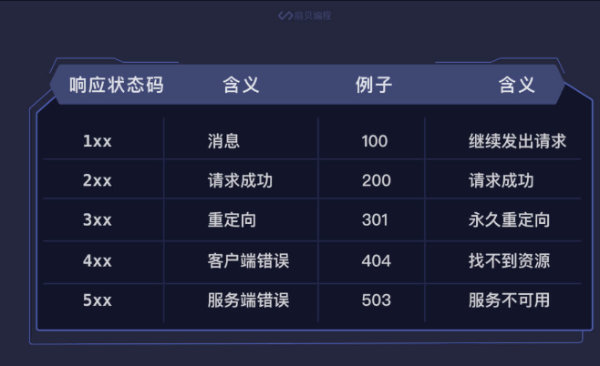

## requests模块
```python
# -*- coding: utf-8 -*-
import requests
res = requests.get('https://wpblog.x0y1.com')
#print(res)
print(res.text)
if res.status_code == 200:
  print('请求成功')
else:
  print('请求失败')

# 获取孔乙己数据
res = requests.get('https://apiv3.shanbay.com/codetime/articles/mnvdu')
# 以写入的方式打开一个名为孔乙己的 txt 文档
with open('孔乙己.txt', 'w' ,encoding='utf8') as file:
  # 将数据的字符串形式写入文件中
  file.write(res.text)

# 获取图片数据
res = requests.get('https://assets.baydn.com/baydn/public/codetime/xiaobei/info.jpg')
# 以二进制写入的方式打开一个名为 info.jpg 的文件
with open('info.jpg', 'wb') as file:
# 将数据的二进制形式写入文件中
  file.write(res.content)
```

变量 **res**它的类型是 **Response** 对象

| 属性            | 含义                 |
| --------------- | -------------------- |
| res.status_code | 响应的 HTTP 状态码   |
| res.text        | 响应内容的字符串形式 |
| res.content     | 响应内容的二进制形式 |
| res.encoding    | 响应内容的编码       |




## 爬虫初体验
> 目标：自动循环小王子的所有章节，将故事存放到一个目录当中，每个章节一份文件。title做为文件名
```python
# -*- coding: utf-8 -*-
import requests

res = requests.get('http://www.eywedu.net/xiaowangzi/14.htm')
res.encoding='gb2312'
text = res.text

with open ('小王子.txt','w',encoding='utf8') as file:
  file.write(text)
```

